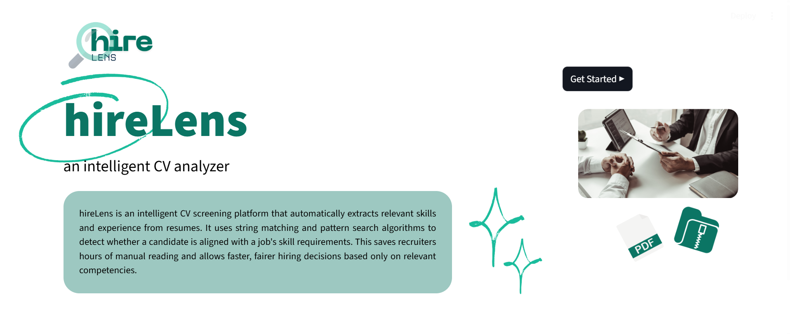
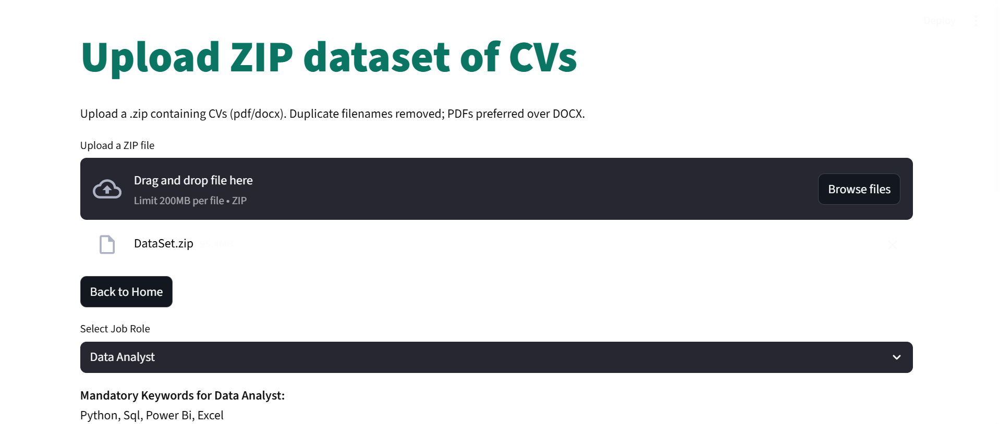
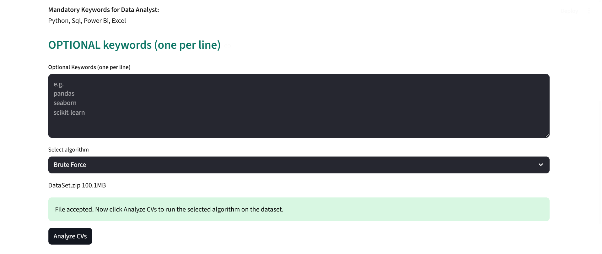
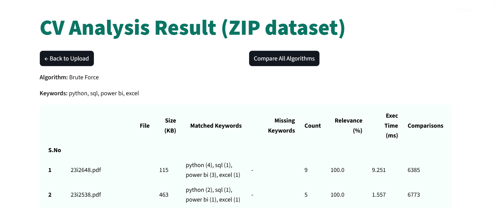
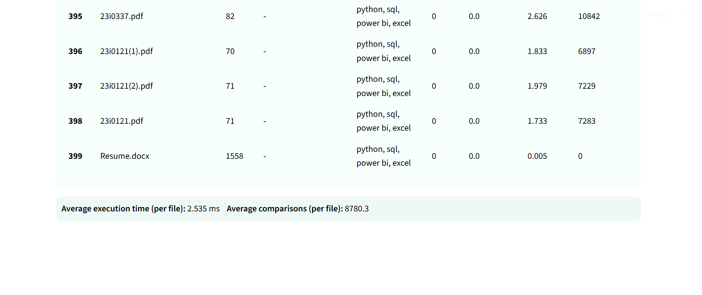
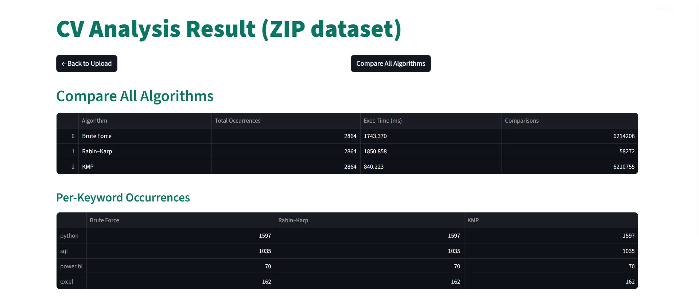

# hireLens

**An Intelligent CV Analyzer**

hireLens is a web-based CV screening platform that automatically extracts relevant skills and experience from resumes using advanced string matching algorithms. It helps recruiters make faster, fairer hiring decisions by analyzing CVs against job-specific keywords.


*Home page with branding and introduction*

## Features

- **Multiple Algorithm Support**: Compare three string matching algorithms:
  - Brute Force (Naive Matching)
  - Rabin-Karp (Hash-based)
  - Knuth-Morris-Pratt (KMP)

- **Batch Processing**: Upload ZIP files containing multiple CVs (PDF/DOCX formats)

- **Job-Specific Screening**: Pre-configured mandatory keywords for common roles:
  - Data Analyst
  - Data Scientist
  - Frontend Developer

- **Custom Keywords**: Add optional keywords for specialized requirements

- **Comprehensive Analysis**:
  - Keyword match counting with plural handling
  - Relevance scoring
  - Execution time measurement
  - Character comparison tracking
  - Algorithm performance comparison

- **User-Friendly Interface**: Clean, responsive design built with Streamlit

## Project Structure

```
hirelens/
│
├── hireLens.py    # Main application file
├── README.md                       # This file
│
├── media/                          # UI assets
│   ├── logo.png                   # Application logo
│   ├── element1.png               # Sparkle decoration
│   ├── element2.png               # Circle background element
│   ├── image1.png                 # Side illustration
│   ├── pdf.png                    # PDF icon
│   └── zip.png                    # ZIP icon
│
├── screenshots/                    # Application screenshots
|   ├── ss1.png                    # Home page
|    ├── ss2.png                    # Upload page with job selection
|    ├── ss3.png                    # Keyword input interface
|    ├── ss4.png                    # Analysis results table
|    ├── ss5.png                    # Performance metrics
|    └── ss6.png                    # Algorithm comparison view
|
├── sample_job_keywords.txt         # Sample optional keywords provided for each job type
```

## Installation

### Prerequisites

- Python 3.8 or higher
- pip (Python package manager)

### Required Libraries

```bash
pip install streamlit
pip install pillow
pip install PyPDF2
pip install python-docx
pip install pandas
```

Or install all dependencies at once:

```bash
pip install streamlit pillow PyPDF2 python-docx pandas
```

## Usage

### 1. Start the Application

Navigate to the project directory and run:

```bash
streamlit run hireLens.py
```

The application will open in your default web browser at `http://localhost:8501`

### 2. Navigate the Interface

#### Home Page
Introduction to hireLens with feature overview and "Get Started" button. Double click on the button to move to upload page.


*Landing page showing hireLens branding, description, and visual elements*

---

#### Upload Page


*Upload page with job role selection and keyword input*

1. Upload a ZIP file containing CV files (PDF or DOCX format)
2. Select a job role from the dropdown (Data Analyst, Data Scientist, or Frontend Developer)
3. View the mandatory keywords for the selected role
4. (Optional) Add custom keywords, one per line 
5. Select an algorithm
6. Double Click "Analyze CVs"


*Mandatory keywords display and optional keyword input area*

---

#### Analysis Page



*Detailed results showing matched/missing keywords and relevance scores*

- View detailed results for each CV including:
  - Matched keywords with occurrence counts
  - Missing keywords
  - Relevance percentage
  - File size
  - Execution time
  - Number of comparisons
- Results are sorted by relevance (highest first)
- See average execution time and comparisons across all CVs


*Average execution time and comparison statistics*

---

#### Algorithm Comparison
Double click on the "Compare All Algorithms" button at the top of the page to compare performance of all three string matching algorithms.


*Side-by-side comparison of all three algorithms with performance metrics*

When you select "Compare All Algorithms", the system runs all three algorithms on your dataset and displays:
- Total occurrences for each algorithm
- Execution time comparison
- Character comparisons count
- Per-keyword occurrence breakdown

## Algorithm Details

### Brute Force (Naive Matching)
- **Complexity**: O(n × m) worst case
- **Method**: Compares pattern at every position
- **Preprocessing**: None
- **Best for**: Short texts or small patterns

### Rabin-Karp
- **Complexity**: O(n + m) average case
- **Method**: Uses rolling hash to match blocks
- **Preprocessing**: Hash computation
- **Best for**: Multiple pattern searches (hash reusability)

### Knuth-Morris-Pratt (KMP)
- **Complexity**: O(n + m) worst case
- **Method**: Builds LPS array to avoid rechecking characters
- **Preprocessing**: LPS table construction
- **Best for**: Single pattern matching in long texts

## Performance Metrics

Based on experimental results from the project:

| Algorithm | Avg. Execution Time | Avg. Comparisons | Speed Ranking |
|-----------|-------------------|------------------|---------------|
| KMP | 1.436 ms | 8,775.6 | Fastest |
| Brute Force | 2.430 ms | 8,780.3 | Medium |
| Rabin-Karp | 3.248 ms | 83.1 | Slowest* |

*Note: Rabin-Karp has the lowest comparisons but higher execution time due to hashing overhead in this dataset

## File Format Support

- **PDF**: Extracted using PyPDF2
- **DOCX**: Extracted using python-docx
- **ZIP**: Batch processing of multiple CVs

**Note**: When duplicate filenames exist (same name with different extensions), PDFs are prioritized over DOCX files.

## Features in Detail

### Keyword Matching
- Case-insensitive matching
- Whole-word matching (avoids partial matches)
- Automatic plural/singular handling (e.g., "python" matches "pythons")

### Relevance Scoring
Calculated as: `(Matched Keywords / Total Keywords) × 100`

### Duplicate Handling
Files with the same base name are processed only once, with PDFs taking precedence.

## Future Improvements

- Multi-pattern Rabin-Karp or Aho-Corasick for efficient multi-keyword search
- Semantic similarity using NLP to detect keyword synonyms
- Database integration for large-scale benchmarking
- Parallel file processing using multiprocessing
- Export results to CSV/Excel
- Advanced filtering and sorting options

## License

This project is for educational purposes.

## Contributing

This is an academic project, but suggestions and improvements are welcome through issues or pull requests.

## Troubleshooting

### Common Issues

**1. Module not found errors**
```bash
pip install [missing-module-name]
```

**2. Images not displaying**
- Ensure the `media/` folder is in the same directory as the Python file
- Check that all image files exist in the media folder

**3. ZIP file not processing**
- Ensure the ZIP contains PDF or DOCX files
- Check that files are not password-protected
- Verify file permissions

**4. Streamlit not starting**
```bash
# Try specifying the port explicitly
streamlit run hireLens.py --server.port 8501
```
---

**hireLens** - Making CV screening intelligent, efficient, and fair.